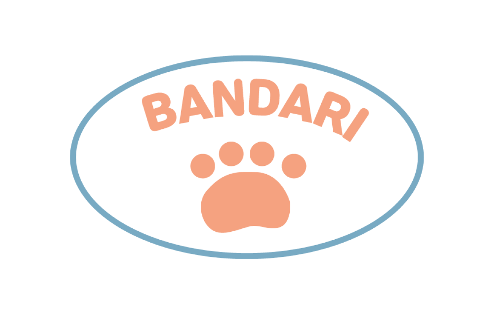

# Bandari

  

## 프로젝트 소개

일상 속에서 폐기물을 줄일 수 있는 제로웨이스트를 쉽게 실천할 수 있게 도와주는 사이트를 제작하고자 했습니다. 
제로웨이스트 샵의 위치 정보를 제공하고, 집에서 다회용 용기를 가져가 음식을 포장해 일회용품을 줄이는 용기내 챌린지의 유행을 전파합니다

 

### 기간
2022/2/10 ~ 2022/2/25 (총 2주)
 
 

### 기술 스택

| JavaScript | TypeScript |  React   |  Redux   | Node   |
| :--------: | :--------: | :------: | :-----: | :-----: |
|   ![js]    |   ![htmlCss]    | ![react] | ![redux] | ![nodejs]   |

 

## 구현 기능

### 1. 회원가입/로그인
- 기본적인 유저정보를 회원가입을 통해 저장할 수 있습니다.
- 로그인한 유저 정보는 기본적으로 Session Storage 에 저장되고, Session Storage에 값이 있을 경우 user라는 Redux Store에 저장됩니다. 
- 리덕스에 저장된 유저정보의 유무값에 따라서 사용자가 할 수 있는 기능을 제한했습니다.

 

### 2. 테마 선택 및 필터링
- Nav바에 테마를 기본, 강아지, 고양이로 구분했고 사용자가 선택한 값을 typeSwitch라는 Redux Store에 저장했습니다. 테마를 변경할 경우 dispatch를 통해 변경해줍니다
- typeSwitch라는 Redux Store에 저장된 테마값으로 판매페이지에서 전체글, 고양이, 강아지 용품 글을 구분해서 불러올 수 있습니다.
- 테마에 따라 다른 컬러와 이미지를 사용해 정체성을 부여하고 보는이로 하여금시각적 즐거움을 줄 수 있게 했습니다.

 

### 3. 판매글 조회 및 글쓰기
- 전체 유저는 판매글을 조회할 수 있지만 로그인하지 않은 유저는 판매자와 연락할 수 없게 제한했습니다. 
- 로그인한 유저는 판매글을 쓸 수 있고, 찜하기 및 판매자와 채팅이 가능합니다.
- 사용자의 위치가 렌더링 시 geoLocation을 통해 가져오고 location이라는 Redux Store에 저장되고, 판매글을 불러올 때 저장된 위치값을 기준으로 가져옵니다.
- 판매글이 내가 쓴 글인지를 redux에 저장된 user정보와 로그인한 유저의 user정보와 삼항연산자를 통해 비교해서 할 수 있는 기능을 구분했습니다. 
- 만약 현재유저userId = 판매글의userId 라면 수정 및 삭제가 가능하고, 아니라면 판매자에게 연락할 수 있습니다.

 

### 4. 채팅
- 채팅 리스트에서 채팅을 선택할 시 selected라는 변수가 useState를 통해 true로 변하고 해당 값이 true일 경우 채팅이 렌더링 됩니다. 
- 채팅에서 빨간X버튼을 클릭할 시 selected라는 변수가 useState를 통해 false로 set하고 채팅리스트를 다시 렌더링합니다.
- 채팅 종료를 클릭할 시 채팅리스트에서 사라지며 이는 디비에 반영됩니다. 
- 채팅은 이전의 값도 불러오기 때문에 세로로 길어질 수 있어서 css로 overflow auto로 스크롤을 통해 볼 수 있습니다.
 대신 처음 창이 렌더링 될 때 맨 처음 보낸 채팅이 보여지기 때문에 , 채팅방을 useRef로 Dom을 선택해주고 scrollTop - scrollHeight를 통해 맨 아래로 자동으로 내려지게 만들어 자연스러운 UX를 만들었습니다.

 

### 5. 마이페이지
- 회원정보 수정 및 탈퇴가 가능합니다
- 회원정보 수정은 모달창으로 뜨게 되는데, 부트스트랩을 사용하지 않고 CSS와 자바스크립트로 만들었습니다.
- redux에 유저 정보가 있을 경우 pet 이라는 Redux Store에 petId가 저장되어 마이페이지 렌더링시 펫 정보를 가져옵니다.
- 찜하기, 판매하기, 구매하기 글은 React Carousel 라이브러리를 사용했고 스타일을 커스터마이징 했습니다. 

 

<!-- Stack Icon Refernces -->

[js]: /imgs/js.png
[htmlCss]:  /imgs/html_css_logo.png
[nodejs]:  /imgs/Node.js_logo.svg.png
[react]:  /imgs/React-icon.png
[redux]:  /imgs/redux.png
